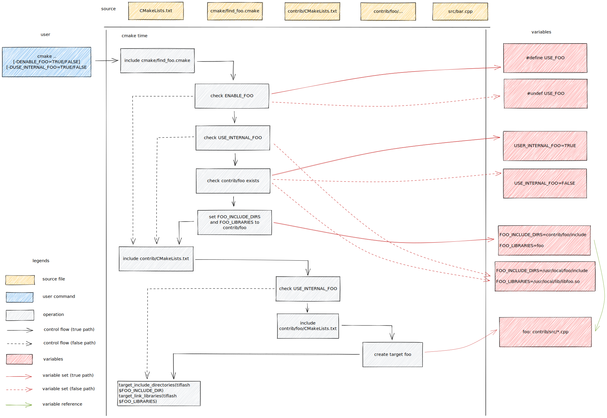

A chart that shows how tiflash manages its dependencies, in example of a hypothetical third-party library `foo` used by a hypothetical tiflash source file `bar.cpp`.

The source of the chart is [here](how-tiflash-manages-dependencies.excalidraw) and editable using https://excalidraw.com/.
